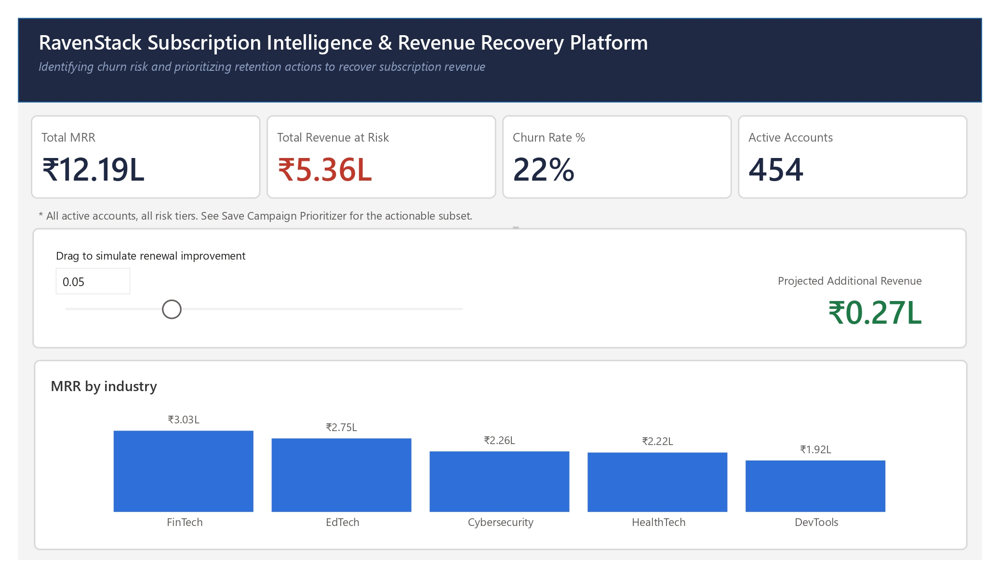
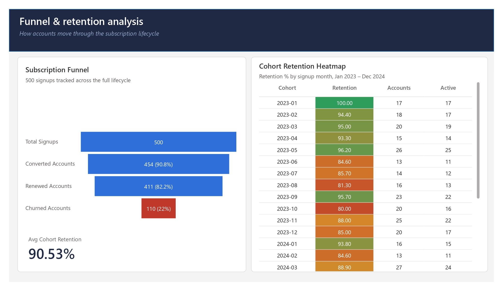
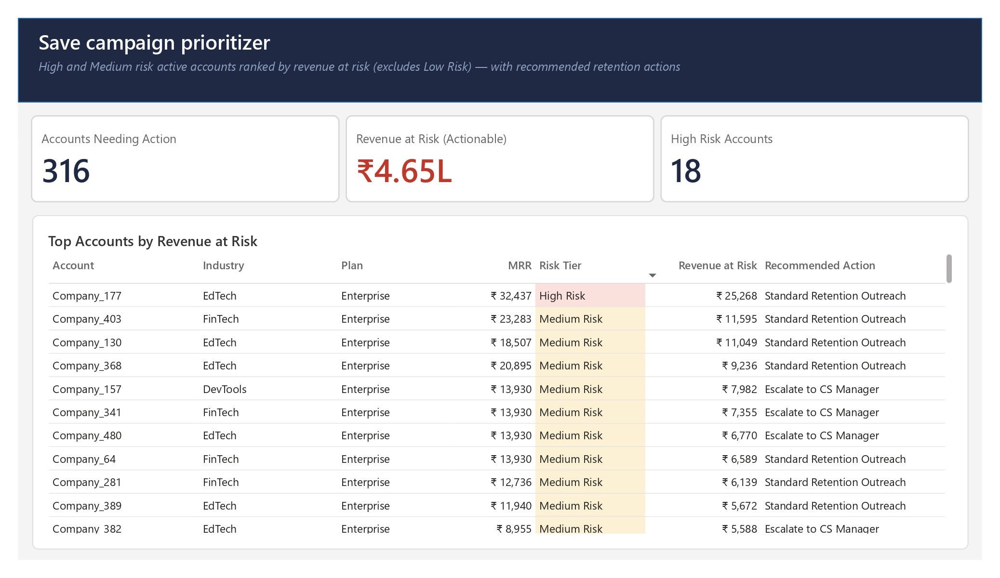

# RavenStack: Subscription Intelligence & Revenue Recovery Platform

An end-to-end analytics project that identifies at-risk subscription revenue, diagnoses churn drivers, and simulates the financial impact of retention actions — built across Python, SQL Server, and Power BI.



---

## Business Problem

RavenStack, a subscription-based SaaS company, has ₹10.78L in monthly recurring revenue (MRR) spread across 500 customer accounts, but 22% of accounts have churned and ₹5.36L in MRR currently sits with active accounts flagged as at-risk. Leadership needed a way to answer three questions:

1. **Where** in the customer lifecycle is revenue being lost?
2. **Why** are accounts churning?
3. **What** should the retention team do about it, and how much could it recover?

This project builds a full pipeline — from raw relational data to an interactive decision-support dashboard — to answer all three.

---

## Architecture

```
Raw CSV data (accounts, subscriptions, usage, support, churn events)
        │
        ▼
Python (pandas) — cleaning, feature engineering, health scoring,
                   revenue-at-risk calculation, churn diagnostics
        │
        ▼
SQL Server — star-schema database, advanced analytical queries
             (CTEs, window functions, business-logic views)
        │
        ▼
Power BI — 3-page interactive dashboard with a live what-if
           revenue-recovery simulator
        │
        ▼
Business recommendations
```

---

## Dataset

Synthetic, multi-table SaaS dataset ("RavenStack" by River @ Rivalytics), fully anonymized, no PII. Five related tables:

| Table | Rows | Description |
|---|---|---|
| accounts | 500 | One row per customer account |
| subscriptions | 5,000 | Full subscription/billing history per account |
| feature_usage | 25,000 | Product usage events |
| support_tickets | 2,000 | Support interaction history |
| churn_events | 600 | Churn instances with reason codes |

---

## What I Built

### Python — Data Engineering & Diagnostics
- Cleaned and standardized 5 relational tables (mixed date formats, referential checks, duplicate detection)
- Engineered a **Customer Health Score** (0–100) from usage, support, and tenure signals
- Calculated **Revenue at Risk** per account, weighted by health score
- Built a churn-risk logistic regression model — and when it underperformed (AUC 0.58), **investigated why instead of hiding it** (see Key Insight below)

### SQL Server — Advanced Analytics Layer
Star-schema database (`Dim_Account`, `Fact_Subscription`, `Fact_Usage`, `Fact_Support`, `Fact_Churn`) with 6 core analytical queries and 5 supporting views, demonstrating:
- CTEs and conditional aggregation (cohort retention)
- Window functions — `RANK`, `ROW_NUMBER`, `NTILE`, `LAG`/`LEAD`
- Business-logic `CASE` statements (Save Campaign Prioritizer)
- Funnel and revenue-quantification queries

See [`SQL/Database_Setup.sql`](SQL/Database_Setup.sql), [`SQL/Analysis_Queries.sql`](SQL/Analysis_Queries.sql), and [`SQL/CREATE_VIEW.sql`](SQL/CREATE_VIEW.sql).

### Power BI — Interactive Dashboard (3 pages)

**1. Executive Overview** — headline KPIs (MRR, revenue at risk, churn rate, active accounts) plus a **live what-if simulator**: drag a slider to model renewal-rate improvement and see projected revenue recovery update in real time.

**2. Funnel & Retention Analysis** — subscription funnel (Signups → Converted → Renewed → Churned) alongside a 24-month cohort retention heatmap.

**3. Save Campaign Prioritizer** — every at-risk active account ranked by revenue impact, each with a specific, rules-based recommended retention action (e.g., "Escalate to CS Manager," "Feature Adoption Nudge").





---

## Key Insight: Why the Churn Model Showed a Weak Signal (and what that means)

A logistic regression trained on behavioral features (usage, support tickets, satisfaction, tenure) to predict churn achieved only **AUC 0.58** — barely better than random. Rather than discard or force-fit this result, I investigated further:

- **Feature correlation with churn was uniformly weak** (max |r| = 0.09 across all engineered features)
- **Churn reason codes are almost evenly distributed** — features (19.0%), support (17.3%), budget (17.3%), unknown (15.8%), competitor (15.3%), pricing (15.2%) — no single dominant cause
- A follow-up SQL query testing whether upgrades/downgrades preceding churn were a stronger signal (Query 6) confirmed the same pattern: churn is **fragmented across causes, not driven by one systemic engagement problem**

**Business implication:** a single retention lever (e.g., "improve onboarding" or "lower prices") won't meaningfully move the needle. This is why the dashboard's Save Campaign Prioritizer assigns **segmented, account-specific recommended actions** rather than a one-size-fits-all retention play — the analysis itself shaped the product design.

---

## Results

- **₹5.36L** in monthly recurring revenue identified as at-risk across 316 active accounts
- **90.5%** average retention across 24 monthly cohorts, with no single month showing systemic collapse
- Built a working revenue-recovery simulator: a 5% improvement in renewal rate is projected to recover **₹26.8K/month (~₹3.2L annualized)**
- Diagnosed and documented a weak ML signal rather than overstating model performance

---

## Tech Stack

Python (pandas, scikit-learn) · SQL Server (T-SQL, CTEs, window functions, views) · Power BI (DAX, what-if parameters) · Jupyter Notebook

---

## Repository Structure

```
RavenStack-Subscription-Intelligence/
├── README.md
├── Dataset/
│   ├── ravenstack_accounts.csv
│   ├── ravenstack_subscriptions.csv
│   ├── ravenstack_feature_usage.csv
│   ├── ravenstack_support_tickets.csv
│   ├── ravenstack_churn_events.csv
│   └── README.md                 (source CSVs)
├── Python/
│   └── 01_EDA_and_Cleaning.ipynb
├── SQL/
│   ├── Database_Setup.sql
│   ├── Analysis_Queries.sql
│   └── CREATE_VIEW.sql
├── PowerBI/
│   └── RavenStack_Dashboard.pbix
├── Images/
│   ├── page1_executive_overview.jpg
│   ├── page2_funnel_retention.jpg
│   └── page3_save_campaign_prioritizer.jpg
└── Documentation/
    └── data_quality_notes.md
```

---

## Data Quality Notes (Transparency)

- `Fact_Usage.usage_id` contained 21 non-unique values (~0.08% of rows) — resolved with a surrogate primary key rather than silently dropping records
- A subset of subscription records show overlapping date ranges (negative day-gaps between subscriptions), preserved as-is and documented rather than artificially cleaned

---

## Future Improvements

- Segmented churn model using structural signals (plan-change history) instead of purely behavioral features
- Monthly trend page if longitudinal operational data becomes available
- Row-level security for role-based dashboard access

---

## Credits

Dataset: RavenStack synthetic SaaS dataset by River @ Rivalytics (MIT-like license, credit required).
